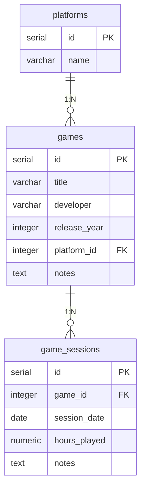

# Game Tracker

Desktopová aplikace pro sledování herní knihovny. Napsaná v **Avalonia UI** s architekturou **MVVM**, data jsou uložena v **PostgreSQL** běžícím v **Dockeru**.

## Funkce

- Správa her (přidání, úprava, smazání)
- Sledování herních relací ke každé hře (datum, hodiny, poznámky)
- Filtrování her podle platformy (číselník: PC, PlayStation, Xbox, Nintendo Switch, Mobile)
- Potvrzovací dialogy při mazání
- Validace vstupů s chybovými hláškami

## Požadavky

- [.NET 8 SDK](https://dotnet.microsoft.com/download)
- [Docker Desktop](https://www.docker.com/products/docker-desktop)

## Spuštění projektu

### 1. Klonování repozitáře

```bash
git clone <url-repozitáře>
cd Formular_Novy/Formular_Novy
```

### 2. Vytvoření konfiguračního souboru

```bash
cp .env.example .env
```

Soubor `.env` **neměň** — výchozí hodnoty fungují s přiloženým `docker-compose.yaml`.

### 3. Spuštění databáze

```bash
docker compose up -d
```

Docker automaticky:
- Stáhne PostgreSQL 16 image
- Vytvoří databázi (`game_tracker`)
- Spustí `schema.sql` (vytvoří tabulky)
- Spustí `seed.sql` (naplní číselník platforem)

### 4. Spuštění aplikace

```bash
dotnet run
```

## Struktura projektu

```
Formular_Novy/
├── Models/                 # Datové třídy (Game, GameSession, Platform)
├── Repositories/           # Přístup k DB (interface + implementace)
├── Services/               # Navigace, dialogový servis
├── ViewModels/             # Logika obrazovek (MVVM)
├── Views/                  # AXAML soubory (UI)
├── Services.cs             # Registrace DI závislostí
├── Program.cs              # Vstupní bod aplikace
├── docker-compose.yaml     # Konfigurace Docker kontejneru
├── schema.sql              # CREATE TABLE skripty
├── seed.sql                # Naplnění číselníku platforem
├── .env.example            # Šablona konfigurace
└── .gitignore              # .env zde MUSÍ být!
```

## Databázové schéma



## Zastavení databáze

```bash
docker compose down          # Zastaví kontejner, data zůstanou
docker compose down -v       # Zastaví A smaže všechna data
```
